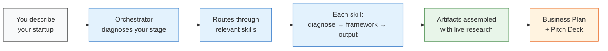
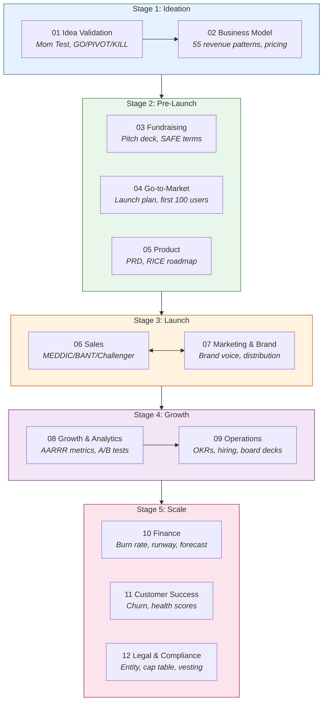
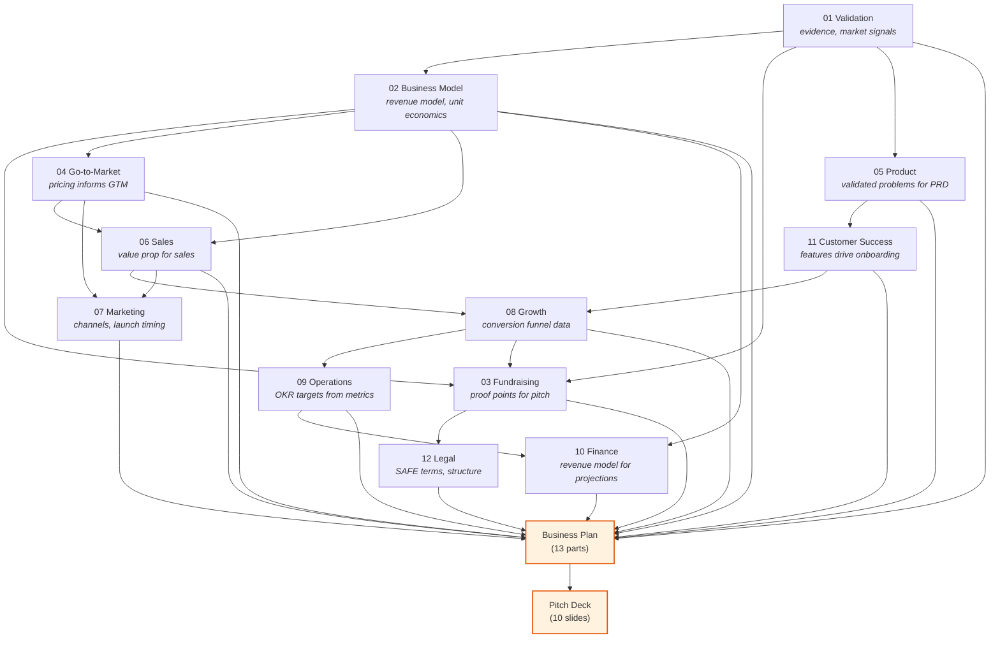
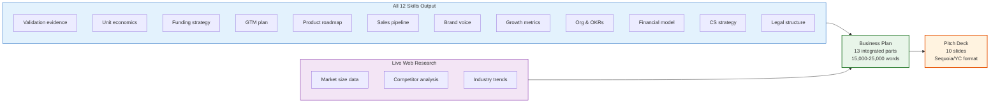

# FounderOS

[](https://github.com/vinicius91carvalho/founder-os/actions/workflows/test.yml)
[](https://github.com/vinicius91carvalho/founder-os/releases)
[](LICENSE)


**12 AI skills + 1 orchestrator that guide founders from idea to scale.**

Give it your startup idea. It diagnoses your stage, runs you through battle-tested frameworks (YC, Sequoia, Mom Test, MEDDIC, and 15+ more), and produces investor-ready artifacts — a 13-part Business Plan and a 10-slide Pitch Deck — with live market research.

No code. No dependencies. Just 75 markdown files encoding 22,000+ lines of structured startup knowledge that turn any AI assistant into a domain-expert copilot.

---

## Platform Compatibility

FounderOS is a **pure-knowledge system** — 75 markdown files with zero code dependencies. It works with any AI assistant that can read markdown files and follow structured prompts.

### Web Research

Some skills use web search for live market data (market sizing, competitor analysis, industry benchmarks). This works on most platforms:

| Platform | Web Research |
|---|---|
| Claude (with MCP tools) | `WebSearch` / `WebFetch` via MCP servers |
| Gemini | Built-in Google Search grounding |
| Cursor / Windsurf | Via `@web` or built-in search |
| ChatGPT | Built-in browsing capability |
| Codex | Built-in web search |
| Perplexity | Native web search |

**Without web access:** All 12 skills work fully. Only the Business Plan and Pitch Deck lose live market data (TAM/SAM/SOM, competitor funding, benchmarks). You can provide this data manually instead.

### Claude-Only Features

These features work **only on Claude** — on other platforms, you get the same results by manually referencing skill files:

| Feature | What It Does | Without Claude |
|---|---|---|
| **Skills system** | Auto-routing via `/skill` commands | Reference `skills/00-orchestrator/SKILL.md` to start |
| **MCP tool integration** | Structured web search with typed responses | Use platform's native web search |
| **Project knowledge** | Native loading of `skills/` as persistent context | Upload/reference skill files manually |
| **Auto-chaining** | Orchestrator invokes skills in sequence automatically | Follow the orchestrator's routing instructions manually |

---

## How It Works



The orchestrator asks 3-5 conversational questions, detects which of the 5 stages you're in, runs the relevant skills in order, accumulates context across skills, and assembles everything into consistent, cross-referenced documents.

---

## The Founder Journey



**You don't need all 12 skills.** The orchestrator routes you to just the ones that match your situation:

| Where you are | Skills you'll use | What you get |
|---|---|---|
| Just have an idea | 01, 02 | GO/PIVOT/KILL verdict + business model |
| Validated, need to raise | 02, 03, 05 | Pitch deck, funding strategy, PRD |
| Planning launch | 04, 05, 07 | GTM playbook, product roadmap, brand guide |
| Need growth systems | 06, 07, 08 | Sales pipeline, content strategy, metrics dashboard |
| Professionalizing ops | 09, 10, 11, 12 | OKRs, financials, CS function, legal structure |
| Full Business Plan | All 12 | 13-part plan + 10-slide pitch deck |

---

## Example Interaction

Here's what a real session looks like. The orchestrator leads a conversational diagnostic, then routes you through the right skills:

```
 YOU    I have a B2B SaaS idea for automating invoice reconciliation
        for mid-market companies. We've talked to 15 finance teams
        and 12 said they'd pay for this. Looking for a complete
        business plan.

CLAUDE  Great — 15 interviews with 80% willingness to pay is strong
        signal. Let me ask a few diagnostic questions:

        1. Have any of those 12 teams committed to a pilot, waitlist,
           or LOI? Or is this still verbal interest?
        2. Do you have a technical co-founder or team, or is this
           solo right now?
        3. Are you planning to raise external funding, or bootstrap?

 YOU    3 teams signed LOIs for pilots. I have a technical co-founder.
        We want to raise a seed round.

CLAUDE  Clear picture. Here's what I'm going to run:

        Stage 1 — Idea Validation (fast pass — you have strong
           evidence already)
        Stage 1 — Business Model (SaaS unit economics, pricing)
        Stage 2 — Fundraising (seed round, SAFE terms, pitch deck)
        Stage 2 — Go-to-Market (pilot → paid conversion playbook)
        Stage 2 — Product (PRD with RICE roadmap)
        ... through all 12 skills ...

        Let's start. For Idea Validation, your 15 interviews are
        strong. Let me assess your evidence against the framework...

        [Skill 01 runs: validates evidence, produces GO verdict]
        [Skill 02 runs: designs SaaS pricing tiers, calculates
         LTV:CAC from your pilot data]
        [Skill 03 runs: builds seed round strategy, structures
         SAFE terms, generates pitch deck content]
        [... each skill builds on the previous outputs ...]

        ── ARTIFACTS GENERATED ──

        Business Plan (13 parts)
           Part 1: Investor One-Pager
           Part 2: Executive Summary
           Part 3: Company & Product Overview
           Part 4: Market Analysis (with live research on the
                   $4.2B accounts payable automation market)
           Part 5: Competitive Analysis (Tipalti, Stampli, etc.)
           ... through Part 13 ...

        Pitch Deck (10 slides)
           Slide 1: ReconcileAI — Automated Invoice Reconciliation
           Slide 2: Problem — 15 interviews, 80% WTP
           Slide 3: Solution — AI-powered three-way matching
           ... through Slide 10: The Ask — $2M seed ...

        All numbers are internally consistent — the unit economics
        from Skill 02 match the financial projections in Part 10,
        which match the "Ask" slide in the pitch deck.
```

> **Note:** This example shows Claude, but the same flow works on any AI platform. Start with "Follow the process in `skills/00-orchestrator/SKILL.md`" and describe your startup.

---

## How Skills Connect

Each skill's outputs feed into downstream skills. The orchestrator maintains a **journey context** so everything stays consistent:



Key cross-skill connections:
- **Validation evidence** (01) becomes pitch deck proof points (03) and PRD problem statements (05)
- **Unit economics** (02) feed financial projections (10) and the "Ask" slide (03)
- **Sales pipeline data** (06) feeds growth metrics (08) which inform OKR targets (09)
- **Customer feedback** (11) loops back to product roadmap (05) and retention metrics (08)

---

## Artifact Assembly

The two final artifacts pull from every skill that ran, plus live web research:



### Business Plan (13 parts)

| Part | Content | Primary Sources |
|---|---|---|
| Investor One-Pager | Problem, solution, traction, ask | Skills 01, 02, 08, 03 |
| Executive Summary | Full business distilled | All skills |
| Company & Product | Product definition, features | Skills 01, 05 |
| Market Analysis | TAM/SAM/SOM with real data | Skill 01 + web research |
| Competitive Analysis | Positioning map, moats | Skill 02 + web research |
| Business Model | Revenue model, unit economics | Skill 02 |
| GTM Playbook | Channels, launch timeline | Skills 04, 06, 07 |
| Financial Model | 3-year projections, scenarios | Skills 02, 10 |
| Operations Plan | Team, OKRs, hiring plan | Skill 09 |
| Customer Success | Onboarding, churn prevention | Skill 11 |
| Legal & Compliance | Entity, cap table, compliance | Skill 12 |
| Risk Analysis | Risks synthesized across domains | All skills |
| Appendices | Detailed supporting data | All skills |

### Pitch Deck (10 slides)

Sequoia/YC hybrid format. Each slide cites the Business Plan section it's backed by, so investors can drill down.

---

## The 12 Skills

Each skill follows the same structure: **diagnose state** → **select workflow** → **apply framework** → **produce outputs** → **pass context forward**.

| # | Skill | What It Does | Key Frameworks |
|---|---|---|---|
| 01 | **Idea Validation** | Stress-test ideas, customer interviews, GO/PIVOT/KILL | Mom Test, Kevin Hale/YC, 60-min validation |
| 02 | **Business Model** | Revenue model selection, pricing, unit economics | 55 model patterns, April Dunford positioning, Van Westendorp |
| 03 | **Fundraising** | Pitch decks, investor targeting, term negotiation | Sequoia/YC deck, SAFE mechanics, VC decision criteria |
| 04 | **Go-to-Market** | Launch strategy, first 100 customers playbook | Racecar Growth, Lenny Rachitsky research, Product Hunt |
| 05 | **Product** | PRDs, prioritized roadmaps, user stories | Square PRD template, RICE scoring, INVEST criteria |
| 06 | **Sales** | Founder-led sales, methodology selection, outreach | MEDDIC, BANT, Challenger Sale |
| 07 | **Marketing & Brand** | Brand voice, content strategy, distribution | 80/20 distribution, community ladder |
| 08 | **Growth & Analytics** | North Star metric, experiments, cohort analysis | AARRR pirate metrics, A/B testing |
| 09 | **Operations** | OKRs, structured hiring, board reporting | Liz Wessel/Google OKRs, interview scorecards |
| 10 | **Finance & Accounting** | Burn rate, runway, cash flow forecasting | 13-week forecast, scenario modeling |
| 11 | **Customer Success** | Onboarding, health scoring, churn prevention | TTFV optimization, churn segmentation |
| 12 | **Legal & Compliance** | Entity structure, cap tables, founder agreements | Entity selection, standard vesting, SAFE terms |

---

## Getting Started

**Just ask anything.** The orchestrator will figure out where you are and guide you through the right skills.

There's no setup, no configuration, no commands to memorize. Describe your startup situation in plain language — the system diagnoses your stage, selects the relevant skills, and walks you through battle-tested frameworks step by step.

### Setup by Platform

| Platform | Setup | Then... |
|---|---|---|
| **Claude Code** | Clone this repo and open it as your working directory | Just start talking |
| **Claude Projects** | Upload the `skills/` folder as project knowledge | Just start talking |
| **Cursor** | Clone the repo; add `skills/` to project context via `.cursorrules` or `@docs` | Reference `skills/00-orchestrator/SKILL.md` to begin |
| **Windsurf** | Clone the repo; add `skills/` to Cascade rules | Reference `skills/00-orchestrator/SKILL.md` to begin |
| **GitHub Copilot** | Clone the repo; reference skill files with `#file` in chat | Reference `skills/00-orchestrator/SKILL.md` to begin |
| **Gemini** (AI Studio / Vertex) | Upload skill files as context or system instructions | Reference `skills/00-orchestrator/SKILL.md` to begin |
| **ChatGPT** | Upload skill files or paste into custom instructions | Reference `skills/00-orchestrator/SKILL.md` to begin |
| **Codex** (OpenAI) | Include skill files in repository context | Reference `skills/00-orchestrator/SKILL.md` to begin |
| **Any other LLM** | Point it at the `skills/` directory | Reference `skills/00-orchestrator/SKILL.md` to begin |

> **Tip for non-Claude platforms:** Start your conversation with "Follow the process in `skills/00-orchestrator/SKILL.md`" and the AI will pick up the orchestrator's diagnostic flow. Or go directly to any skill: "Follow `skills/01-idea-validation/SKILL.md` to validate my idea."

### Example Prompts

You don't need to know which skill to use. Just describe what you need:

```
"I have a startup idea and need a complete business plan."
"Help me validate my startup idea."
"I need to figure out my pricing."
"Prepare me for fundraising."
"Plan my product launch."
"Write a PRD for my product."
"Help me build a sales process."
"Define my brand voice."
"Set up my growth metrics."
"Help me structure my team and OKRs."
"I need to understand my burn rate and runway."
"Reduce our churn rate."
"Set up my company's legal structure."
"I've validated my idea and need to prepare for fundraising."
"We've launched but need to scale our growth."
```

The orchestrator routes each of these to the right skill(s) automatically.

---

## Project Structure

```
founder-os/
├── README.md
├── LICENSE
├── VERSION
├── skills/
│   ├── README.md                          # Skills index
│   ├── SKILL-TEMPLATE.md                  # Template all skills follow
│   ├── shared/
│   │   ├── founder-journey-map.md         # 5-stage routing logic
│   │   ├── cross-skill-data-flow.md       # What each skill produces/consumes
│   │   ├── artifact-format.md             # Standard output format
│   │   └── disclaimer-templates.md        # Legal/financial disclaimers
│   ├── 00-orchestrator/
│   │   ├── SKILL.md                       # Routing, context passing, research
│   │   ├── templates/intake-questionnaire.md
│   │   └── artifacts/
│   │       ├── business-plan.md           # 13-part generator
│   │       └── pitch-deck.md              # 10-slide generator
│   └── 01-idea-validation/ ... 12-legal-compliance/
│       ├── SKILL.md                       # Diagnostic + workflows + frameworks
│       ├── templates/                     # Fillable step-by-step guides
│       └── frameworks/                    # Methodology references
└── .github/
    └── workflows/
        └── test.yml                       # CI workflow
```

Each skill directory follows the same pattern:
- **SKILL.md** — Diagnostic workflow, decision trees, anti-patterns, skill interconnections
- **templates/** — Fillable templates founders complete step-by-step
- **frameworks/** — Named methodology references with real-world examples

---

## Requirements

- **Any AI assistant** capable of reading markdown files and following structured prompts (Claude, Gemini, GPT-4+, Cursor, Windsurf, Copilot, Codex, etc.)
- **Web search capability** (optional) for live market research in Business Plan and Pitch Deck generation. All skills work without web access — only artifact quality is reduced for market-data-dependent sections.

---

## Important Notes

- **Not a replacement for professionals.** Legal, financial, and tax guidance is educational. Consult qualified professionals for decisions in regulated domains.
- **Iterative, not final.** All artifacts are Version 1.0. Iterate based on real-world feedback from customers, investors, and advisors.
- **No code required.** This is a pure knowledge system — 75 markdown files with 22,000+ lines of structured, interconnected startup knowledge. No build process, no dependencies, no deployment.

---

## Contributing

Contributions are welcome! Each skill follows the structure defined in `skills/SKILL-TEMPLATE.md`. To add or improve a skill:

1. Follow the template structure: Diagnostic → Workflows → Frameworks → Anti-patterns → Interconnections
2. Ensure outputs are defined in `skills/shared/cross-skill-data-flow.md`
3. Test with real startup scenarios across multiple AI platforms

---

## License

MIT License. See [LICENSE](LICENSE).

## Author

Created by [Vinicius Carvalho](https://github.com/vinicius91carvalho).
